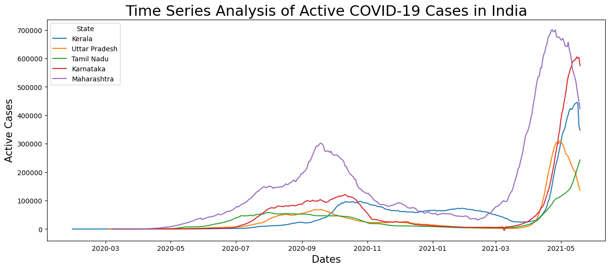
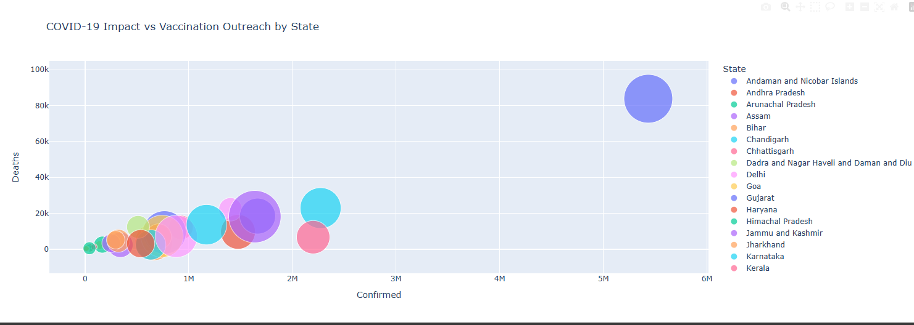

# 📊 COVID-19 Insight and Analysis using Python

This project analyzes COVID-19 case and vaccination data in India to uncover key trends and insights. It leverages data cleaning, exploratory data analysis (EDA), feature engineering, and interactive visualizations to understand the pandemic’s progression and vaccination efforts across states.

---

## 🧩 Problem Statement

Tracking COVID-19’s spread and vaccination rollout at the state level is critical for effective public health responses. This project aims to provide a clear, data-driven view of infection growth and vaccine distribution patterns in India to support informed decision-making.

---

## 🎯 Project Goals

- Analyze daily new confirmed, cured, and death cases across Indian states  
- Identify states with highest case growth and vaccination coverage  
- Extract key vaccination KPIs such as total doses, dose breakdowns, and AEFI reports  
- Visualize trends over time with animated and static charts for better understanding  
- Highlight disparities or areas of concern in vaccination rates and adverse effects  

---

## 🔧 Project Workflow

- Imported two datasets: daily COVID-19 case counts and state-wise vaccination data for India  
- Cleaned and prepared the datasets, handling missing values and data types  
- Conducted Exploratory Data Analysis (EDA) using summary statistics, distribution plots, and correlation checks  
- Engineered features like daily new cases, cumulative counts, and vaccination ratios  
- Created interactive visualizations using Plotly and Seaborn including animated bar races and line plots with hue differentiation  
- Built KPIs with Plotly Indicators to display vaccination progress and safety alerts  
- Used Python and Jupyter Notebook environment for coding and visualization  
- [Google Colab Notebook Link](https://colab.research.google.com/drive/1Fyi67YnY6DHNIxkh93agyV_SXaZC_kQv?usp=sharing)

---

## 🖼 Dashboard Preview

  
  

---

## 🔍 Key Insights

- States like Maharashtra and Karnataka showed the highest confirmed COVID-19 case growth during peak periods  
- Vaccination rollout has large variations among states, with some lagging significantly behind in total doses administered  
- Adverse events following immunization (AEFI) are low overall but require monitoring in specific regions  
- Male to female vaccination dose ratios reveal interesting demographic trends  
- Animated visuals effectively highlight temporal dynamics of case surges and vaccine progress  

---

## 📖 Summary

This project delivers an insightful exploration of COVID-19 and vaccination data in India, helping visualize complex data trends and key health metrics in an accessible way. It combines data science fundamentals with compelling visual storytelling to support pandemic analysis and public health strategies.
